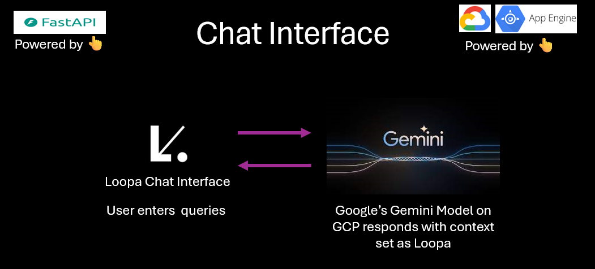
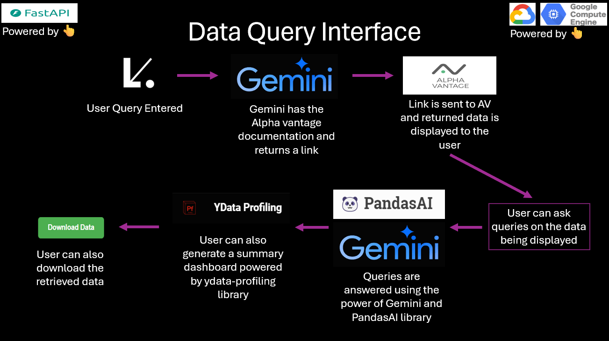
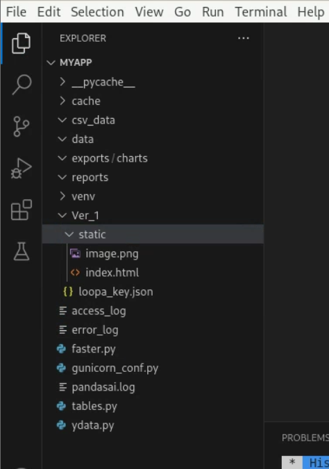
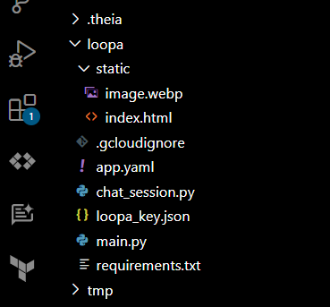

# Loopa

# Introduction - 
This project offers a two-pronged approach to investment exploration. One, a chat interface powered by the investment-focused LLM Loopa provides personalized advice. Two, another LLM taps into Alpha Vantage's market data, allowing you to ask questions like "Give me daily forex rates in INR" and get the answer in a downloadable CSV format. You can then delve deeper using Pandas or visualize it with an auto-generated dashboard. It's your one-stop shop for investment research and analysis!

# Examples to use it - 
#### You can ask queries relating to the below topics👇
The sections are <Core Stock APIs:[TIME_SERIES_INTRADAY,TIME_SERIES_DAILY,TIME_SERIES_WEEKLY,TIME_SERIES_MONTHLY,GLOBAL_QUOTE,SYMBOL_SEARCH,MARKET_STATUS],
Alpha Intellligence:[NEWS_SENTIMENT,TOP_GAINERS_LOSERS],
Fundamental Data:[OVERVIEW,INCOME_STATEMENT,BALANCE_SHEET,CASH_FLOW,EARNINGS,LISTING_STATUS,EARNINGS_CALENDAR,IPO_CALENDAR],
Forex(FX):[CURRENCY_EXHANGE_RATE,FX_DAILY,FX_WEEKLY,FX_MONTHLY],
Cryptocurrencies:[CURRENCY_EXCHANGE_RATE,DIGITAL_CURRENCY_DAILY,DIGITAL_CURRENCY_WEEKLY,DIGITAL_CURRENCY_MONTHLY],
Economic Inidicators:[REAL_GDP,REAL_GDP_PER_CAPITA,TREASURY_YIELD,FEDERAL_FUNDS_RATE,CPI,INFLATION,RETAIL_SALES,DURABLES,UNEMPLOYMENT,NONFARM_PAYROLL]>

Note - For the full info take a look at the 'alpha_vantage_prompt.txt' file in the repo.

#### Few example questions to ask in Data Query Interface - 
1. Give me usd to inr forex daily?
 
 Query for table : What is the date range of the data? / Give me mean of the open and low column?

2. Give me inflation data of the US monthly?
 
 Query for table : what is the average inflation? / Give me the mean of the value data

3. Give me the income statement of google
 
 Query for table1 : what is the average total revenue?
 Query for table2 : Give me the difference between the average of gross profit and total revenue

# Chat Interface - 


# Data Query Interface - 


# Architecture - 




# How to deploy the Data Query Interface?
1. Head over to your GCP console and create a service account json key with the following configurations - 


2. Replace the info in the file 'loopa_key.json' with you json key info in the 'Compute_Engine/V2' folder.
3. Head over to the Compute Engine section in GCP and create a VM of the following configurations - 


4. Now we will need to work pretty deep in Ubuntu to set up the app. Hence, we will install a UI on our VM to make things easier for us. Install UI on VM by [clicking here](https://cloud.google.com/architecture/chrome-desktop-remote-on-compute-engine#gnome). I personally prefer Genome for the UI🫠.
5. After the UI is successfully set up, login to your VM. You will be greeted with this👇


6. Click on the activities tab on the left upper corner. Search for 'Sofware' and install VS Code. Once VS Code is installed open it.


7. Create a folder named myapp and use it as the working directory in VS Code.
8. Create the following folder structure and files in your working directory. Then copy-paste the code name wise from the folder 'Compute_Engine/V2' onto the files created on the VM using VS Code. No Need to make the '__pycache__, cache, venv' folders and 'access_log, error_log, pandasai.log' files. Make sure to put your GCP project ID and Alpha Vantage API key in the code. 



9. Now change the file paths in the codes according to your VM.
10. Open the terminal and install pip using the following command - 
```
sudo apt-install python3-pip
```
11. Install all the libraries mentioned in the requirements.txt file in 'Compute_Engine/V2' folder.
12. Now make sure to put your GCP project ID wherever required in the code files.
13. You should now be able to run the project locally on the Ubuntu VM by running the 'faster.py' file. After it's working locally, proceed to the next step to be able to access it over the internet.
14. To be able to take your project online, refer to this link by [clicking here](https://www.slingacademy.com/article/deploying-fastapi-on-ubuntu-with-nginx-and-lets-encrypt/)
15. While going through the above tutorial, use the 'gunicorn_conf.py and service.txt' files that I have provided in 'Compute_Engine/V2' folder not of the previous website. Also make sure to change the path addresses accordingly.
16. I know this step may be tough to do but with a bit of patience and help from Gemini you can make it successfully.
17. Congrats🚀🚀 The Data Query Interface is now online. You should be able to access it using the external IP address of your VM.

# How to deploy the Chat Interface? 
1. First get the API key for using Gemini from [here](https://aistudio.google.com/app/apikey). 
2. Head over to your GCP Console and open your Code Editor using the Cloud Shell.
3. Open your default folder in the New Code Editor and make a folder named 'loopa'.
4. Create the following folder structure and files in the loopa folder. 



5. Copy-paste the code name wise from the folder 'App_Engine/V2' folder.
6. Also put the API key acquired in step-1 in line-7 of the code 'App_Engine/V2/chat_session.py'. 
7. Loopa-key is the same service account key you used in the above steps. Also make sure to put your GCP project ID wherever required in the code files.
8. In the 'index.html' file replace the IP address with the external IP address of your VM near the line number 236.
9. Open the Cloud Shell Terminal and set the project using the command
```
gcloud config set project <YOUR GCP PROJECT ID>
```
10. Now in the terminal navigate to the folder 'loopa' using the command -
```
cd loopa
```
11. Now to deploy using App Engine enter the following command -
```
gcloud app deploy
```
12. Proceed accordingly in the terminal.
13. After the deployment you should be able to access the project using the link displayed in the terminal.
14. Clicking on the Chat with data button on the right bottom corner will take you to the Data Query Interface🫠.

# Troubleshooting - 
1. Raise and error, I will try to resolve it.
2. Use Gemini and the internet wisely before raising error😂.

#### Thank you for getting till here. Keep hunting!!! Keep grinding!!! See you in the next project🚀🚀


