# Loopa

# Introduction - 
This project offers a two-pronged approach to investment exploration. One, a chat interface powered by the investment-focused LLM Loopa provides personalized advice. Two, another LLM taps into Alpha Vantage's market data, allowing you to ask questions like "Give me daily forex rates in INR" and get the answer in a downloadable CSV format. You can then delve deeper using Pandas or visualize it with an auto-generated dashboard. It's your one-stop shop for investment research and analysis!

# Chat Interface - 
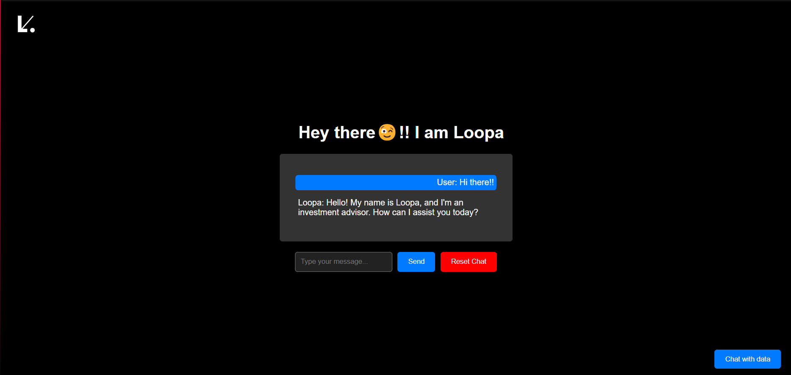

# Data Query Interface - 
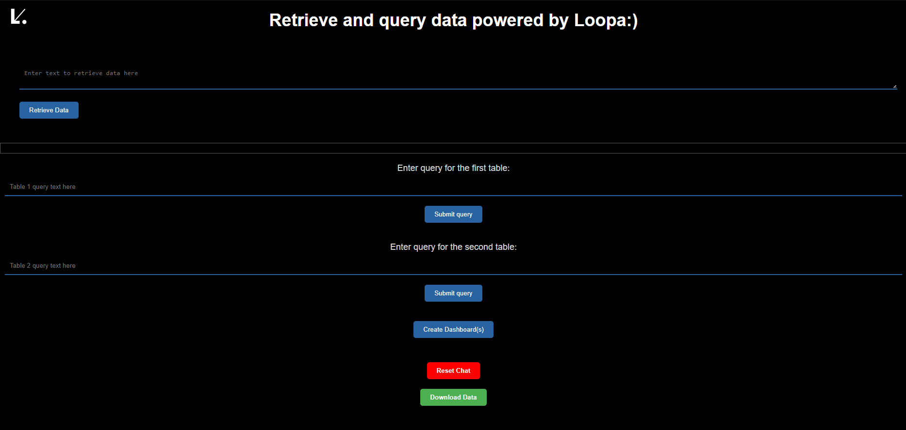

# Architecture - 
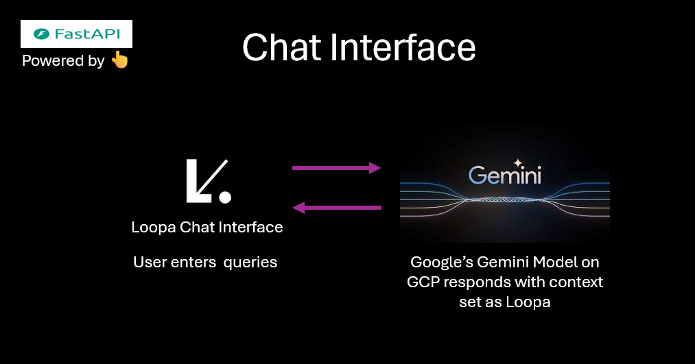

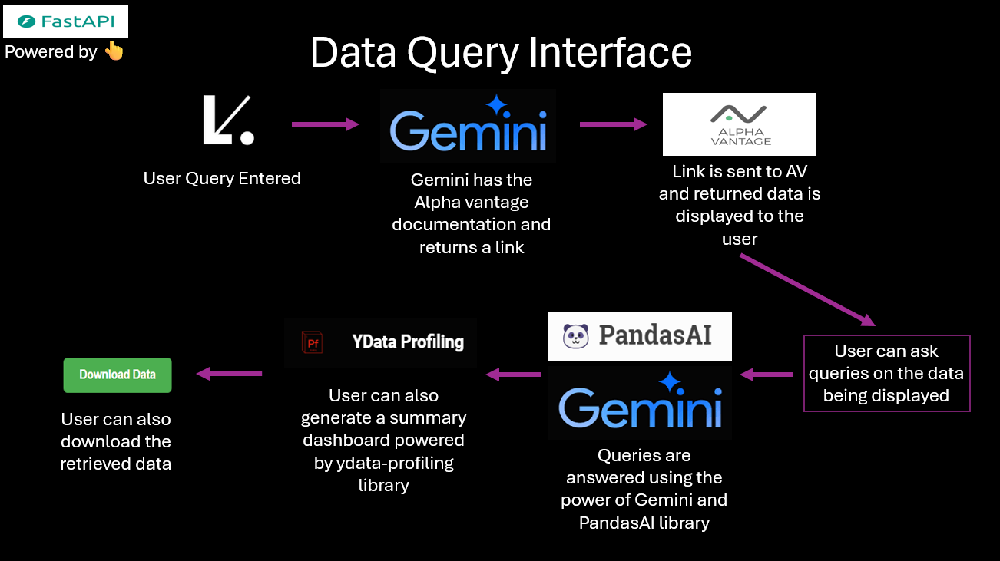

# How to deploy the Data Query Interface?
1. Head over to your GCP console and create a service account json key with the following configurations - 

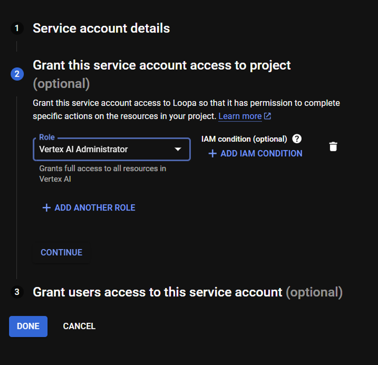

2. Replace the info in the file 'loopa_key.json' with you json key info in the 'Compute_Engine/V2' folder.
3. Head over to the Compute Engine section in GCP and create a VM of the following configurations - 

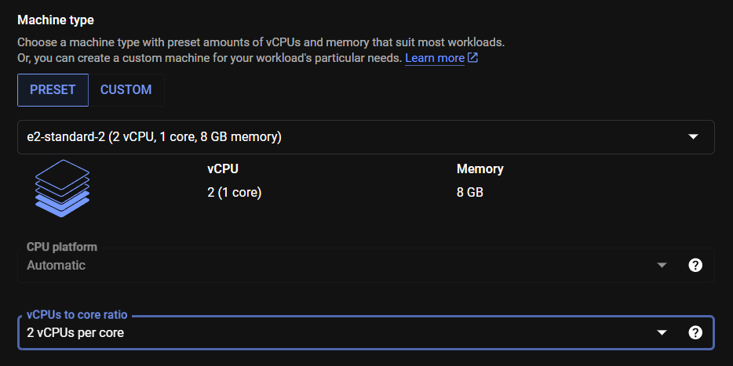

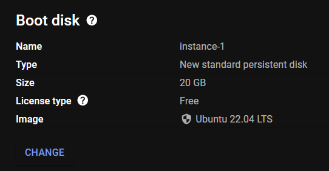

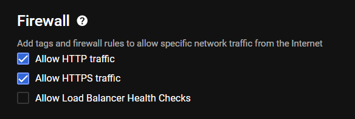

4. Now we will need to work pretty deep in Ubuntu to set up the app. Hence, we will install a UI on our VM to make things easier for us. Install UI on VM by [clicking here](https://cloud.google.com/architecture/chrome-desktop-remote-on-compute-engine#gnome). I personally prefer Genome for the UI🫠.
5. After the UI is successfully set up, login to your VM. You will be greeted with this👇

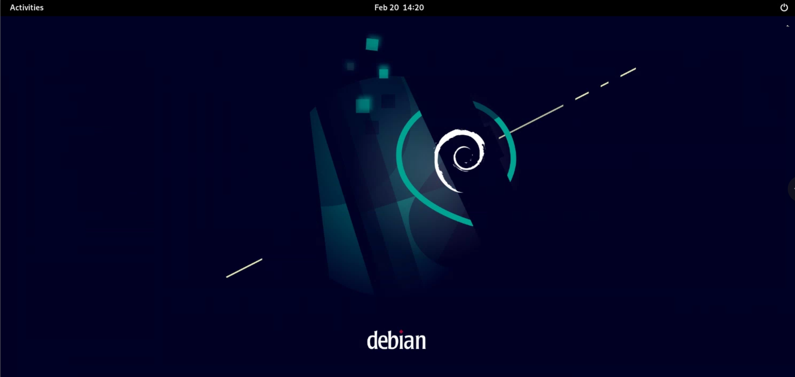

6. Click on the activities tab on the left upper corner. Search for 'Sofware' and install VS Code. Once VS Code is installed open it.

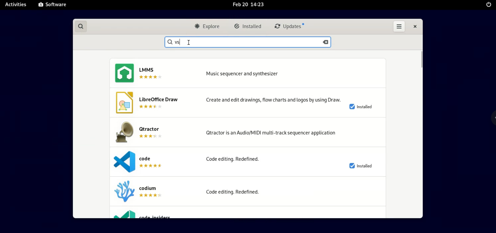

7. Create a folder named myapp and use it as the working directory in VS Code.
8. Create the following folder structure and files in your working directory. Then copy-paste the code name wise from the folder 'Compute_Engine/V2' onto the files created on the VM using VS Code. No Need to make the '__pycache__, cache, venv' folders and 'access_log, error_log, pandasai.log' files. Make sure to put your GCP project ID and Alpha Vantage API key in the code. 

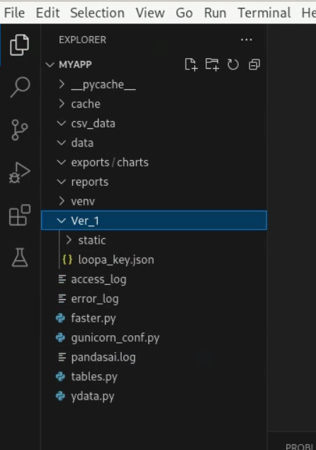

9. Now change the file paths in the codes according to your VM.
10. Open the terminal and install pip using the following command - 
```
sudo apt-install python3-pip
```
11. Install all the libraries mentioned in the requirements.txt file in 'Compute_Engine/V2' folder. 


